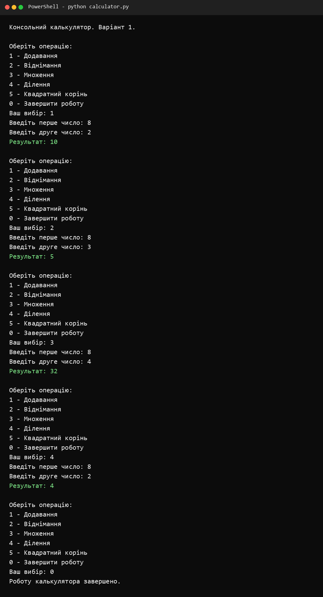
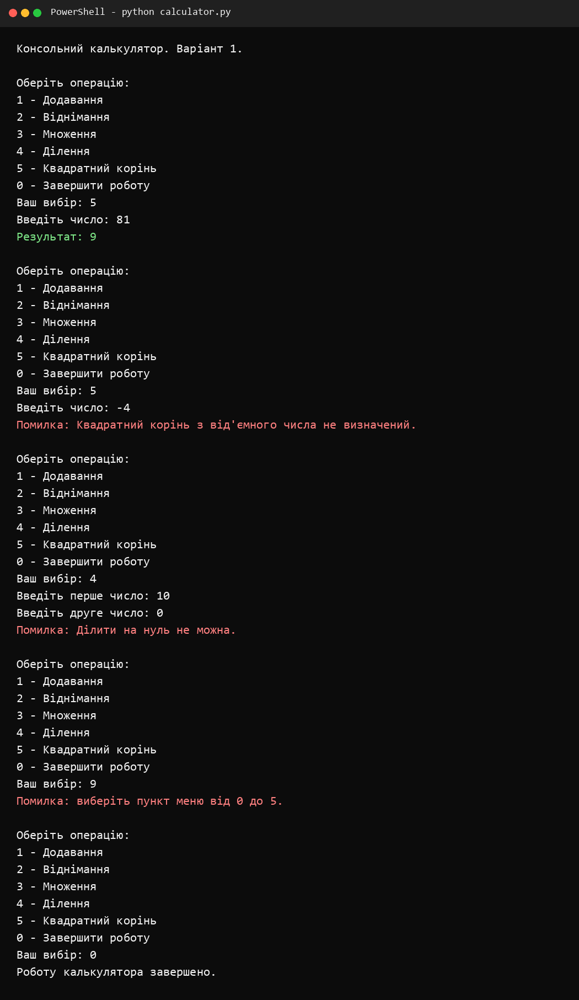
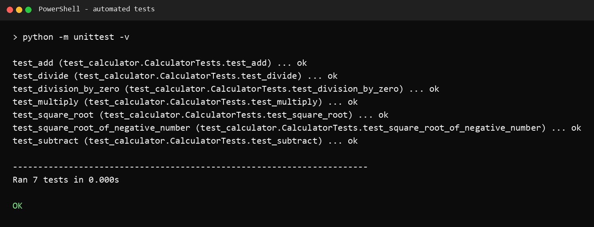

<div align="center">

**ЗВІТ**  
до лабораторної роботи №1  
з дисципліни **«Python основи»**

**Тема:** «Використання конструкцій мови Python, робота з базовими типами та введенням даних»

</div>

| Відомості | Дані |
|---|---|
| Виконав | Левченко Д. В. |
| Варіант | 1 |
| Перевірив | Андреєв П. І. |
| Рік виконання | 2026 |

## Мета роботи

Ознайомитися з конструкціями мови Python, закріпити навички роботи з базовими типами даних, введенням і виведенням інформації, умовними конструкціями, циклами, функціями та математичним модулем `math`.

## Постановка завдання

Розробити консольний калькулятор мовою Python, який виконує додавання, віднімання, множення та ділення. Відповідно до варіанта №1 додатково реалізувати обчислення квадратного кореня числа.

## Використані засоби

- мова програмування Python 3;
- стандартний модуль `math`;
- модуль `unittest` для автоматичної перевірки;
- консольний інтерфейс користувача.

## Хід виконання роботи

1. Створено окремі функції для додавання, віднімання, множення, ділення та обчислення квадратного кореня.
2. Реалізовано текстове меню та повторне виконання операцій до вибору команди завершення.
3. Додано перевірку введених значень, захист від ділення на нуль і від обчислення квадратного кореня з від'ємного числа.
4. Забезпечено введення дробових чисел як із крапкою, так і з комою.
5. Створено автоматичні тести для всіх арифметичних функцій та основних помилкових ситуацій.

Алгоритм роботи програми:

```text
Початок
  Вивести меню
  Зчитати пункт меню
  Якщо обрано 0 - завершити програму
  Якщо обрано 1-4 - зчитати два числа та виконати операцію
  Якщо обрано 5 - зчитати число та обчислити квадратний корінь
  Якщо сталася помилка - вивести зрозуміле повідомлення
  Повернутися до меню
Кінець
```

Повний вихідний код доступний у файлі [`calculator.py`](./calculator.py), а автоматичні тести - у файлі [`test_calculator.py`](./test_calculator.py).

## Результати виконання

На рисунку 1 продемонстровано виконання базових арифметичних операцій.



<p align="center"><em>Рисунок 1 - Виконання додавання, віднімання, множення та ділення</em></p>

На рисунку 2 наведено виконання індивідуального завдання варіанта №1 та перевірку обробки помилкових значень.



<p align="center"><em>Рисунок 2 - Обчислення квадратного кореня та повідомлення про помилки</em></p>

Результат автоматичного тестування наведено на рисунку 3. Усі тести завершилися успішно.



<p align="center"><em>Рисунок 3 - Результат автоматичного тестування програми</em></p>

## Відповіді на контрольні питання

### 1. Які особливості синтаксису Python відрізняють його від інших мов програмування?

Python використовує відступи для позначення блоків коду, не потребує фігурних дужок і крапок з комою наприкінці рядка. Синтаксис є лаконічним, а тип змінної визначається під час виконання програми. Коментар починається символом `#`.

### 2. Які основні базові типи даних існують у Python та для чого вони використовуються?

- `int` - цілі числа;
- `float` - дійсні числа;
- `complex` - комплексні числа;
- `bool` - логічні значення `True` та `False`;
- `str` - текстові рядки;
- `list` - змінювані послідовності;
- `tuple` - незмінювані послідовності;
- `set` - множини унікальних елементів;
- `dict` - набори пар «ключ - значення».

### 3. Як працює цикл `for` у Python та яку роль у ньому виконує функція `range()`?

Цикл `for` послідовно перебирає елементи ітерованого об'єкта. Функція `range()` створює послідовність цілих чисел із заданими початком, межею та кроком, тому часто використовується для повторення дії визначену кількість разів.

### 4. Чому отримані від користувача дані через `input()` часто потрібно перетворювати за допомогою `int()` або `float()`?

Функція `input()` завжди повертає рядок. Для математичних операцій цей рядок необхідно перетворити на числовий тип: `int` для цілих чисел або `float` для дійсних.

### 5. Що таке динамічна типізація в Python і як вона впливає на роботу зі змінними?

За динамічної типізації тип належить значенню, а не оголошеній змінній. Тип не потрібно зазначати наперед, і змінна може посилатися на значення різних типів у різні моменти виконання. Водночас програміст має контролювати сумісність типів під час операцій.

## Висновок

Під час лабораторної роботи створено консольний калькулятор мовою Python. Реалізовано чотири базові арифметичні операції та додаткову функцію варіанта №1 - обчислення квадратного кореня. Додано перевірку введення й обробку некоректних ситуацій. Коректність основних функцій підтверджено автоматичними тестами.

