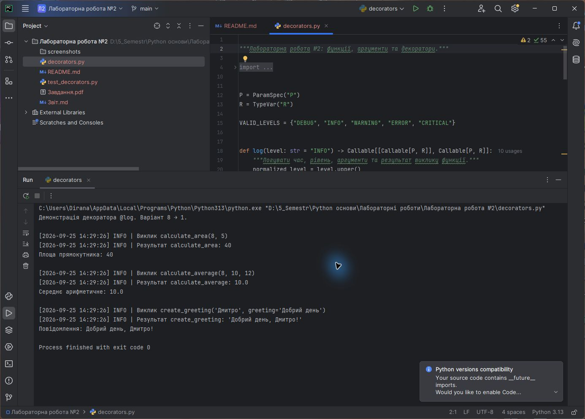
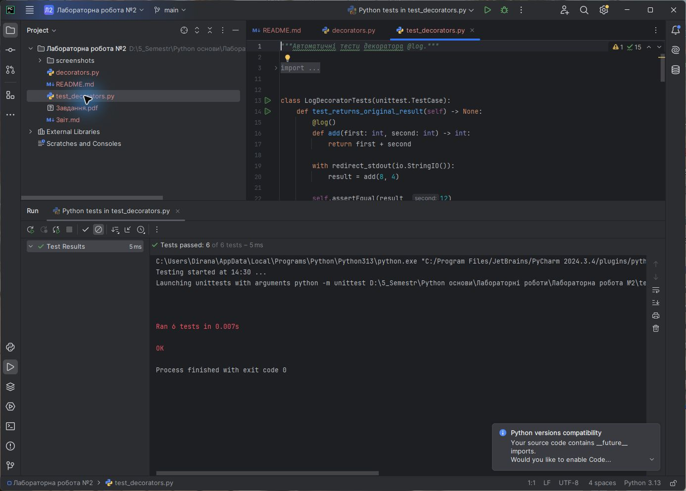

<div align="center">

**ЗВІТ**<br>
до лабораторної роботи №2<br>
з дисципліни **«Python основи»**

**Тема:** «Практичне використання функцій, аргументів та декораторів»

</div>

| Відомості | Дані |
|---|---|
| Виконав | Левченко Д. В. |
| Номер студента | 8 |
| Варіант | 1 |
| Перевірив | Андреєв П. І. |
| Рік виконання | 2026 |

## Визначення варіанта

У методичній вказівці наведено 7 варіантів. За циклічним розподілом номер студента 8 відповідає першому варіанту:

```text
((8 - 1) mod 7) + 1 = 1
```

Отже, завдання полягає у створенні декоратора `@log` з параметром `level="INFO"`, який виконує розширене логування викликів: часу, аргументів і результату.

## Мета роботи

Навчитися створювати та використовувати функції, передавати позиційні й ключові аргументи, застосовувати `*args` і `**kwargs`, а також розробляти власні декоратори мовою Python.

## Постановка завдання

Розробити параметризований декоратор `@log`, який:

- за замовчуванням використовує рівень `INFO`;
- фіксує дату й час виклику функції;
- виводить ім'я функції та передані позиційні й ключові аргументи;
- виводить повернутий функцією результат;
- зберігає метадані декорованої функції;
- повідомляє про винятки та повторно їх передає для обробки програмою.

## Використані засоби

- середовище розробки PyCharm;
- мова програмування Python 3;
- стандартні модулі `datetime`, `functools`, `typing` та `unittest`;
- система контролю версій Git.

## Хід виконання роботи

1. Створено фабрику декораторів `log(level="INFO")`.
2. Додано перевірку рівнів `DEBUG`, `INFO`, `WARNING`, `ERROR` і `CRITICAL`.
3. Внутрішня функція `wrapper` приймає довільні позиційні та ключові аргументи через `*args` і `**kwargs`.
4. За допомогою `datetime.now()` формується час виклику.
5. Декоратор виводить аргументи перед виконанням функції та результат після її завершення.
6. Для збереження імені й документації функції використано `functools.wraps`.
7. Роботу перевірено на функціях обчислення площі, середнього арифметичного та створення привітання.
8. Створено автоматичні модульні тести.

Узагальнений алгоритм декоратора:

```text
Отримати рівень логування
Перевірити коректність рівня
Отримати декоровану функцію
  Під час виклику wrapper:
    зафіксувати час
    сформувати текст аргументів
    вивести інформацію про виклик
    виконати початкову функцію
    вивести її результат або повідомлення про помилку
    повернути результат
```

Повний код наведено у файлі [`decorators.py`](./decorators.py), тести - у файлі [`test_decorators.py`](./test_decorators.py).

## Результати виконання

На рисунку 1 показано вихідний код і результат запуску програми в середовищі PyCharm. У консолі відображено час, рівень `INFO`, аргументи та результати трьох декорованих функцій.



<p align="center"><em>Рисунок 1 - Виконання програми з декоратором @log у PyCharm</em></p>

На рисунку 2 наведено результат автоматичного тестування декоратора в PyCharm.



<p align="center"><em>Рисунок 2 - Успішне виконання автоматичних тестів у PyCharm</em></p>

## Відповіді на контрольні питання

### 1. Чим параметр відрізняється від аргументу?

Параметр - це змінна, зазначена в оголошенні функції. Аргумент - конкретне значення, яке передається цьому параметру під час виклику функції.

### 2. Поясніть механізм передачі аргументів у Python

Під час виклику функції об'єкти зв'язуються з її локальними параметрами. Аргументи можна передавати за позицією або за ім'ям. Python передає посилання на об'єкти, тому змінювані об'єкти можуть бути змінені всередині функції, а перепризначення локального параметра не змінює змінну виклику.

### 3. Що таке `*args` та `**kwargs`?

`*args` збирає зайві позиційні аргументи в кортеж, а `**kwargs` збирає зайві ключові аргументи у словник. Вони дозволяють функції приймати змінну кількість аргументів і є особливо корисними в декораторах.

### 4. Що таке декоратор?

Декоратор - це функція, яка приймає іншу функцію або клас і повертає об'єкт із розширеною чи зміненою поведінкою без редагування початкової реалізації. Для застосування декоратора використовується синтаксис `@назва`.

### 5. Що таке позиційно-ключові (`/` та `*`) маркери в сигнатурі функції?

Параметри ліворуч від `/` можна передавати лише позиційно. Параметри праворуч від `*` можна передавати лише за іменем. Параметри між цими маркерами допускають обидва способи передачі. Такі обмеження роблять інтерфейс функції однозначнішим.

## Висновок

У лабораторній роботі розроблено параметризований декоратор `@log` для розширеного логування викликів функцій. Він фіксує час, рівень, аргументи, результат і помилки, підтримує довільні сигнатури через `*args` та `**kwargs` і зберігає метадані функцій. Коректність реалізації підтверджено автоматичними тестами та запуском у PyCharm.
