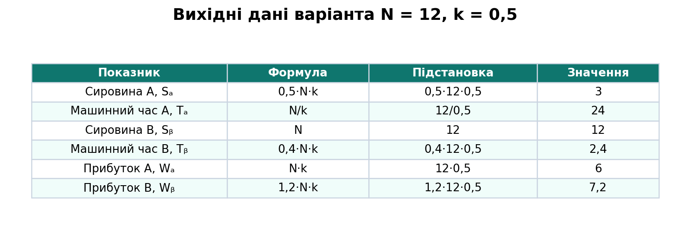
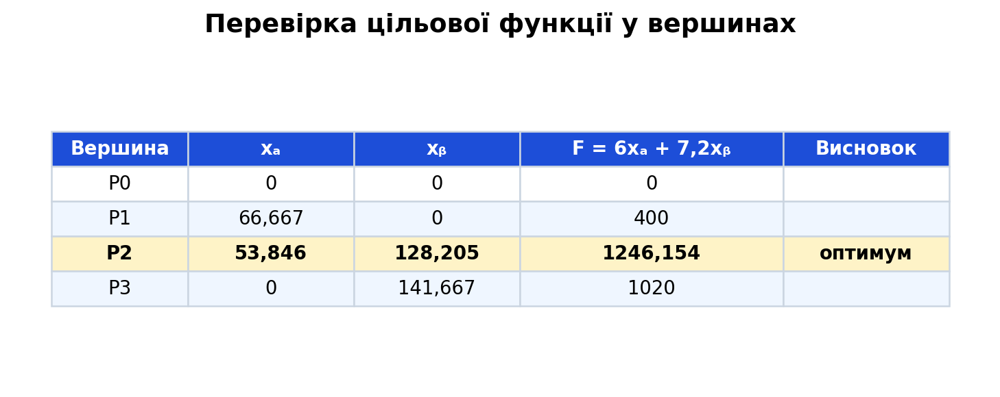
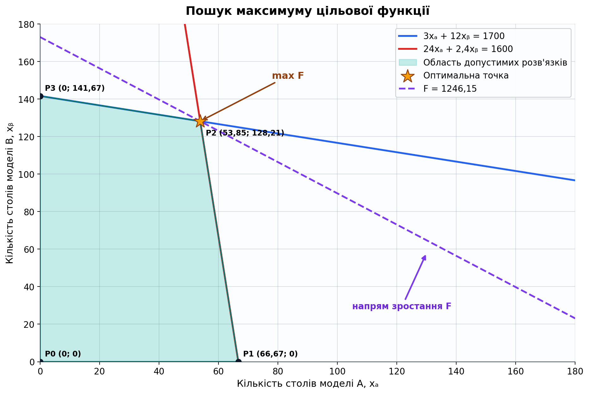
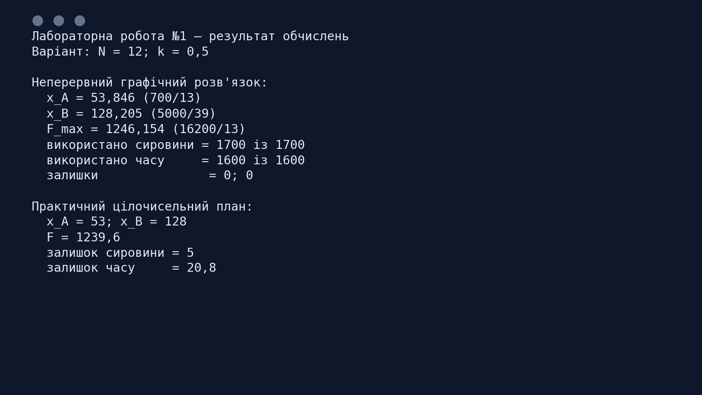

# Лабораторна робота № 1

## Двомірна задача лінійного програмування

[← До переліку лабораторних](../README.md) · [Код програми](./src/solve_lab1.py) · [Автоматичні тести](./tests/test_solution.py) · [Усі ілюстрації](./assets/screenshots/)

| Поле | Значення |
|---|---|
| Дисципліна | Дослідження операцій |
| Виконав | Левченко Д. В. |
| Перевірила | Бурдільна Є. В. |
| Варіант | \(N=12\) |
| Коефіцієнт | \(k=0{,}5\) |
| Інструмент | Python 3, Matplotlib |

## Зміст

1. [Тема та мета](#1-тема-та-мета)
2. [Постановка задачі](#2-постановка-задачі)
3. [Вихідні дані](#3-вихідні-дані)
4. [Математична модель](#4-математична-модель)
5. [Графічний розв'язок](#5-графічний-розвязок)
6. [Прибуток і залишки ресурсів](#6-прибуток-і-залишки-ресурсів)
7. [Практичний цілочисельний план](#7-практичний-цілочисельний-план)
8. [Аналіз результатів](#8-аналіз-результатів)
9. [Контрольні питання](#9-контрольні-питання)
10. [Запуск програми](#10-запуск-програми)
11. [Структура проєкту](#11-структура-проєкту)

<a id="figures" name="figures"></a>

### Навігація за рисунками

| № | Ілюстрація |
|---:|---|
| 1 | [Розрахунок вихідних даних](#figure-1) |
| 2 | [Область допустимих розв'язків](#figure-2) |
| 3 | [Перевірка цільової функції у вершинах](#figure-3) |
| 4 | [Пошук максимуму цільової функції](#figure-4) |
| 5 | [Результат виконання програми](#figure-5) |

## 1. Тема та мета

**Тема:** двомірна задача лінійного програмування.

**Мета:** набути навичок розв'язування двовимірних задач лінійного програмування графічним методом, побудувати область допустимих розв'язків, визначити оптимальний виробничий план та проаналізувати використання ресурсів.

## 2. Постановка задачі

Підприємство виготовляє столи двох моделей: A і B.

- на один стіл A потрібно \(S_A\) одиниць сировини та \(T_A\) одиниць машинного часу;
- на один стіл B потрібно \(S_B\) одиниць сировини та \(T_B\) одиниць машинного часу;
- прибуток від реалізації одного столу становить \(W_A\) та \(W_B\) грошових одиниць відповідно;
- підприємство має 1700 одиниць сировини та 1600 одиниць машинного часу.

Необхідно визначити план виробництва, який забезпечує максимальний прибуток.

## 3. Вихідні дані

За умовою варіанта:

| Показник | Формула | Підстановка | Значення |
|---|---:|---:|---:|
| \(S_A\) | \(0{,}5Nk\) | \(0{,}5\cdot12\cdot0{,}5\) | 3 |
| \(T_A\) | \(N/k\) | \(12/0{,}5\) | 24 |
| \(S_B\) | \(N\) | \(12\) | 12 |
| \(T_B\) | \(0{,}4Nk\) | \(0{,}4\cdot12\cdot0{,}5\) | 2,4 |
| \(W_A\) | \(Nk\) | \(12\cdot0{,}5\) | 6 |
| \(W_B\) | \(1{,}2Nk\) | \(1{,}2\cdot12\cdot0{,}5\) | 7,2 |

Результат підстановки коефіцієнтів також подано на [рисунку 1](#figure-1).

<a id="figure-1" name="figure-1"></a>
<p align="center">
  <a href="./assets/screenshots/01-вихідні-дані.png">
    
  </a>
</p>
<p align="center"><em>Рисунок 1 – Розрахунок вихідних даних для варіанта 12</em></p>
<p align="center"><sub><a href="#figures">↑ До переліку рисунків</a></sub></p>

## 4. Математична модель

Позначимо:

- \(x_A\) - кількість столів моделі A;
- \(x_B\) - кількість столів моделі B.

Цільова функція - максимізація сумарного прибутку:

$$
F=6x_A+7{,}2x_B\rightarrow\max.
$$

Система обмежень:

$$
\begin{cases}
3x_A+12x_B\leq1700, & \text{сировина};\\
24x_A+2{,}4x_B\leq1600, & \text{машинний час};\\
x_A\geq0,\;x_B\geq0. & \text{невід'ємність}.
\end{cases}
$$

Для побудови граничних прямих нерівності замінюємо рівняннями:

$$
x_B=\frac{1700-3x_A}{12},
\qquad
x_B=\frac{1600-24x_A}{2{,}4}.
$$

## 5. Графічний розв'язок

Перетин півплощин, заданих обмеженнями та умовами невід'ємності, утворює допустимий чотирикутник, показаний на [рисунку 2](#figure-2).

<a id="figure-2" name="figure-2"></a>
<p align="center">
  <a href="./assets/screenshots/02-область-допустимих-розв'язків.png">
    
  </a>
</p>
<p align="center"><em>Рисунок 2 – Область допустимих розв'язків та її кутові точки</em></p>
<p align="center"><sub><a href="#figures">↑ До переліку рисунків</a></sub></p>

Координати точки перетину двох ресурсних обмежень знайдемо із системи:

$$
\begin{cases}
3x_A+12x_B=1700,\\
24x_A+2{,}4x_B=1600.
\end{cases}
$$

Точний розв'язок системи:

$$
x_A=\frac{700}{13}\approx53{,}846,
\qquad
x_B=\frac{5000}{39}\approx128{,}205.
$$

Значення цільової функції у вершинах області:

| Вершина | \(x_A\) | \(x_B\) | \(F=6x_A+7{,}2x_B\) |
|---|---:|---:|---:|
| \(P_0\) | 0 | 0 | 0 |
| \(P_1\) | 66,667 | 0 | 400 |
| \(P_2\) | 53,846 | 128,205 | **1246,154** |
| \(P_3\) | 0 | 141,667 | 1020 |

Порівняння отриманих значень наочно наведено на [рисунку 3](#figure-3).

<a id="figure-3" name="figure-3"></a>
<p align="center">
  <a href="./assets/screenshots/04-перевірка-вершин.png">
    
  </a>
</p>
<p align="center"><em>Рисунок 3 – Порівняння значень цільової функції у кутових точках</em></p>
<p align="center"><sub><a href="#figures">↑ До переліку рисунків</a></sub></p>

Лінію рівня цільової функції переміщуємо паралельно в напрямі вектора градієнта \(\nabla F=(6;7{,}2)\). Остання спільна точка цієї лінії з допустимою областю - \(P_2\), що показано на [рисунку 4](#figure-4).

<a id="figure-4" name="figure-4"></a>
<p align="center">
  <a href="./assets/screenshots/03-цільова-функція.png">
    
  </a>
</p>
<p align="center"><em>Рисунок 4 – Оптимальна лінія рівня та напрям зростання цільової функції</em></p>
<p align="center"><sub><a href="#figures">↑ До переліку рисунків</a></sub></p>

Отже, неперервний оптимальний план:

$$
X^*=\left(\frac{700}{13};\frac{5000}{39}\right)
\approx(53{,}846;128{,}205).
$$

Максимальний прогнозований прибуток:

$$
F_{\max}
=6\cdot\frac{700}{13}+7{,}2\cdot\frac{5000}{39}
=\frac{16200}{13}
\approx\mathbf{1246{,}154}\text{ грош. од.}
$$

## 6. Прибуток і залишки ресурсів

Перевірка використання сировини:

$$
3\cdot\frac{700}{13}+12\cdot\frac{5000}{39}=1700.
$$

Залишок сировини:

$$
R_S=1700-1700=\mathbf{0}.
$$

Перевірка використання машинного часу:

$$
24\cdot\frac{700}{13}+2{,}4\cdot\frac{5000}{39}=1600.
$$

Залишок машинного часу:

$$
R_T=1600-1600=\mathbf{0}.
$$

Обидва ресурси в оптимальній точці використано повністю, тобто обидва обмеження є активними. Підсумковий вивід програми наведено на [рисунку 5](#figure-5).

<a id="figure-5" name="figure-5"></a>
<p align="center">
  <a href="./assets/screenshots/05-результат-програми.png">
    
  </a>
</p>
<p align="center"><em>Рисунок 5 – Підсумок автоматизованого розрахунку</em></p>
<p align="center"><sub><a href="#figures">↑ До переліку рисунків</a></sub></p>

## 7. Практичний цілочисельний план

Графічний метод розв'язує неперервну ЗЛП, тому отримані кількості столів є дробовими. Якщо випускати можна лише цілі столи, простого округлення координат недостатньо: округлений план може стати недопустимим або неоптимальним.

Повний перебір допустимих цілих планів, реалізований у програмі, дає:

$$
x_A=53,\qquad x_B=128,\qquad F=1239{,}6.
$$

| Показник | Використано | Доступно | Залишок |
|---|---:|---:|---:|
| Сировина | \(3\cdot53+12\cdot128=1695\) | 1700 | **5** |
| Машинний час | \(24\cdot53+2{,}4\cdot128=1579{,}2\) | 1600 | **20,8** |

Цілочисельний план наведено як практичне доповнення. Основною відповіддю за вимогою лабораторної роботи є неперервний графічний розв'язок.

## 8. Аналіз результатів

1. Максимум неперервної задачі досягається у точці перетину обмежень за сировиною та машинним часом.
2. В оптимальному неперервному плані потрібно виробляти приблизно 53,846 столу A та 128,205 столу B.
3. Прогнозований прибуток становить приблизно 1246,154 грошової одиниці.
4. Сировина і машинний час використані повністю; збільшення лише одного ресурсу без збільшення другого не гарантує пропорційного приросту прибутку.
5. Для реального виробництва доцільний цілочисельний план: 53 столи A та 128 столів B із прибутком 1239,6 грошової одиниці.

## 9. Контрольні питання

<details>
<summary><strong>1. Які задачі називають задачами лінійного програмування?</strong></summary>

Задачі пошуку максимуму або мінімуму лінійної цільової функції за системи лінійних рівнянь чи нерівностей і заданих обмежень на змінні.
</details>

<details>
<summary><strong>2. Що таке цільова функція?</strong></summary>

Це математичний вираз показника ефективності, значення якого необхідно максимізувати або мінімізувати.
</details>

<details>
<summary><strong>3. Як записуються рівняння обмежень?</strong></summary>

У вигляді лінійних рівнянь або нерівностей: \(a_{i1}x_1+\dots+a_{in}x_n\leq b_i\), \(\geq b_i\) або \(=b_i\).
</details>

<details>
<summary><strong>4. Які обмеження обов'язково застосовуються до задач оптимального виробництва?</strong></summary>

Обмеження ресурсів і умови невід'ємності змінних. Якщо продукція неподільна, додатково задають умову цілочисельності.
</details>

<details>
<summary><strong>5. Який розв'язок ЗЛП називають оптимальним?</strong></summary>

Допустимий розв'язок, у якому цільова функція набуває найкращого можливого значення.
</details>

<details>
<summary><strong>6. Надайте геометричну інтерпретацію ЗЛП.</strong></summary>

Кожне обмеження задає півплощину, їх перетин утворює опуклу допустиму область, а цільова функція - сімейство паралельних прямих рівня. Оптимум досягається у кутовій точці або вздовж ребра допустимої області.
</details>

<details>
<summary><strong>7. Яка точка допустимої множини називається кутовою?</strong></summary>

Точка, яку неможливо подати як нетривіальну опуклу комбінацію двох інших різних допустимих точок. У двовимірній задачі це вершина допустимого багатокутника.
</details>

<details>
<summary><strong>8. Поясніть алгоритм графічного методу.</strong></summary>

Потрібно побудувати граничні прямі обмежень, визначити потрібні півплощини та їх спільну допустиму область, знайти її вершини, побудувати лінію рівня цільової функції й перемістити її паралельно в напрямі поліпшення. Точка останнього дотику з допустимою областю є оптимальною.
</details>

## 10. Запуск програми

Потрібен Python 3.10 або новіший.

```bash
python -m pip install -r requirements.txt
python src/solve_lab1.py
python -m unittest discover -s tests -v
```

Після запуску програма виводить результат у консоль і заново створює всі PNG-ілюстрації у каталозі [`assets/screenshots`](./assets/screenshots/).

## 11. Структура проєкту

```text
Лабораторна робота 01/
├── README.md                  # повний звіт
├── requirements.txt           # залежності Python
├── assets/
│   └── screenshots/           # графіки, таблиці та результат програми
├── src/
│   └── solve_lab1.py          # обчислення та побудова ілюстрацій
└── tests/
    └── test_solution.py       # перевірка коефіцієнтів і оптимумів
```

## Висновок

Для варіанта \(N=12\), \(k=0{,}5\) графічним методом знайдено неперервний оптимальний план \(x_A\approx53{,}846\), \(x_B\approx128{,}205\). Максимальний прогнозований прибуток дорівнює \(F_{\max}\approx1246{,}154\) грошової одиниці. Сировина та машинний час використовуються повністю. Для неподільної продукції рекомендовано план із 53 столів A і 128 столів B.
