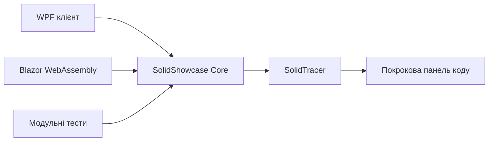

# Архітектура і принципи SOLID

## Загальна схема

Інтерфейси WPF і Blazor не містять предметних алгоритмів. Вони викликають `DemoEnvironment`, показують результат і відображають кроки з `SolidTracer`.

## Завдання 1 Data Import Pipeline

### S Single Responsibility Principle

- `IDataReader` і `StringDataReader` отримують вхідні дані.
- `ITransactionParser` перетворює текст у транзакції.
- `ITransactionValidator` перевіряє одну транзакцію.
- `ITransactionRepository` зберігає валідні транзакції.
- `IImportSummaryWriter` формує підсумок.

### O Open Closed Principle

`CsvTransactionParser` і `JsonTransactionParser` реалізують `ITransactionParser`. Підтримка XML або YAML додається новим класом без зміни `ImportProcessor`.

### L Liskov Substitution Principle

Будь-який коректний `IDataReader` можна передати в `ImportProcessor`. Алгоритм однаково працює з рядком, файлом або мережевим потоком.

### I Interface Segregation Principle

Прогрес і підсумковий звіт розділені на `IProgressReporter` та `IImportSummaryWriter`. Простий індикатор прогресу не реалізує зайві операції.

### D Dependency Inversion Principle

`ImportProcessor` отримує всі компоненти через конструктор і залежить тільки від інтерфейсів.

## Завдання 2 Каталог бібліотеки

### S Single Responsibility Principle

- `Book`, `Newspaper`, `Almanac` описують дані видань.
- `ICatalogRepository` відповідає за збереження.
- `CatalogService` координує операції каталогу.
- Стратегії пошуку перевіряють окремий критерій.

### O Open Closed Principle

Новий тип видання наслідує `LibraryItem`. Новий пошук реалізує `ILibrarySearchStrategy`. Існуючий сервіс змінювати не потрібно.

### L Liskov Substitution Principle

Книга, газета й альманах додаються, видаляються та виводяться через спільний тип `LibraryItem`.

### I Interface Segregation Principle

`ICatalogRepository`, `ILibrarySearchStrategy` та `ILibraryItemFactory` є окремими компактними контрактами.

### D Dependency Inversion Principle

`CatalogService` залежить від `ICatalogRepository` та `ILibraryItemFactory`, а не від конкретного списку або способу створення об'єктів.

## Завдання 3 Автобаза

### S Single Responsibility Principle

- `BestFitVehicleSelectionStrategy` вибирає транспорт за вантажопідйомністю.
- `ExperienceDriverSelectionStrategy` вибирає водія за стажем.
- `DispatchService` координує життєвий цикл рейсу.
- `IFleetRepository` зберігає стан автобази.

### O Open Closed Principle

Алгоритми підбору реалізують `IDriverSelectionStrategy` та `IVehicleSelectionStrategy`. Можна додати економний, швидкісний або пріоритетний алгоритм без зміни диспетчера.

### L Liskov Substitution Principle

Будь-яка реалізація стратегії, яка дотримується контракту, може замінити поточну і повернути придатного водія або автомобіль.

### I Interface Segregation Principle

Стратегії підбору не містять методів ремонту, виплат або збереження. Кожний клієнт залежить тільки від потрібних операцій.

### D Dependency Inversion Principle

`DispatchService` працює через `IFleetRepository`, `IDriverSelectionStrategy` та `IVehicleSelectionStrategy`.

## Покрокове трасування

`SolidTracer` отримує структурований `SolidTraceStep` у важливих точках сценарію. Крок містить назву дії, клас і метод, принцип SOLID, пояснення, фрагмент коду та номер активного рядка. Обидва інтерфейси відображають одну й ту саму трасу, тому браузерна демонстрація відповідає WPF-програмі.
