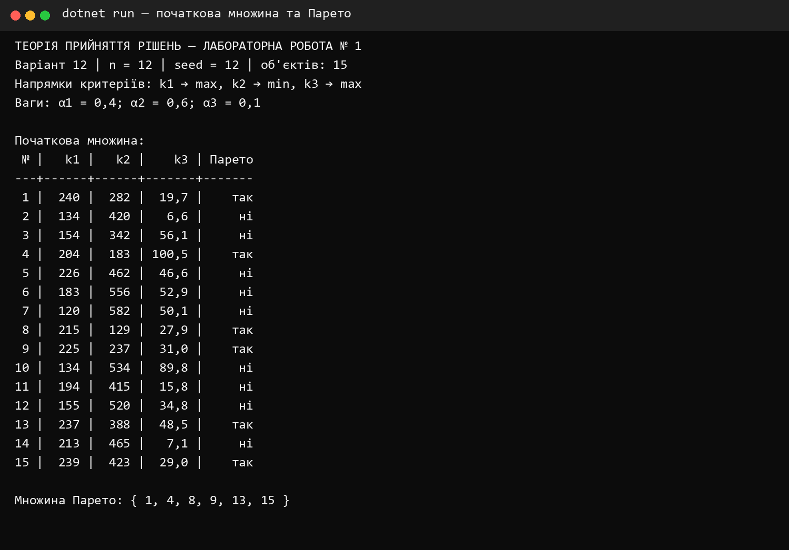
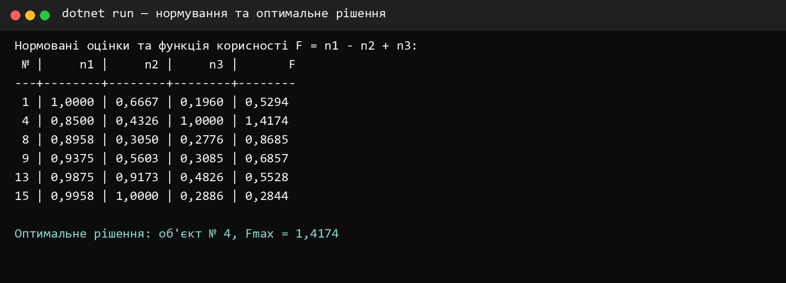
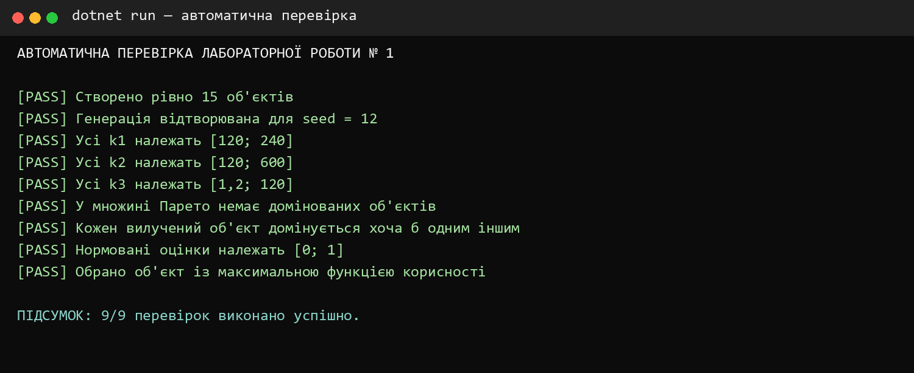

<div align="center">

**КРЕМЕНЧУЦЬКИЙ НАЦІОНАЛЬНИЙ УНІВЕРСИТЕТ  
ІМЕНІ МИХАЙЛА ОСТРОГРАДСЬКОГО**

**КАФЕДРА АВТОМАТИЗАЦІЇ ТА ІНФОРМАЦІЙНИХ СИСТЕМ**

# ЗВІТ З ЛАБОРАТОРНОЇ РОБОТИ № 1

з навчальної дисципліни **«Теорія прийняття рішень»**

**Варіант 12**

</div>

| Відомості | Дані |
|---|---|
| Виконав | студент групи КН-24-1 Левченко Д. В. |
| Перевірила | доцент кафедри Рилова Н. В. |
| Місце та рік | Кременчук, 2026 |

## ТЕМА

Багатокритеріальні задачі прийняття рішень. Формування множини Парето.

## МЕТА

Вивчити методи розв'язання багатокритеріальних задач прийняття рішень під час проєктування та отримати навички вибору рішень у ситуаціях різної інформованості особи, яка приймає рішення, про важливість критеріїв.

## ПОСТАНОВКА ЗАВДАННЯ

Для варіанта № 12 потрібно згенерувати 15 об'єктів за трьома критеріями у межах `k1 ∈ [120; 240]`, `k2 ∈ [120; 600]`, `k3 ∈ [1,2; 120]`. Критерії `k1` і `k3` максимізуються, а `k2` мінімізується. Вагові коефіцієнти: `α1 = 0,4`, `α2 = 0,6`, `α3 = 0,1`.

Необхідно сформувати множину Парето, врахувати вагові коефіцієнти, нормувати критерії, обчислити функцію корисності та визначити оптимальний об'єкт. Для відтворюваності псевдовипадкової генерації використано початкове значення `seed = 12`.

## КОРОТКІ ТЕОРЕТИЧНІ ВІДОМОСТІ

Альтернатива належить множині Парето, якщо не існує іншої альтернативи, яка не гірша за всіма критеріями та строго краща хоча б за одним. У цій роботі об'єкт `A` домінує об'єкт `B`, якщо одночасно `k1(A) ≥ k1(B)`, `k2(A) ≤ k2(B)`, `k3(A) ≥ k3(B)`, і хоча б одна нерівність є строгою.

Після вилучення домінованих об'єктів оцінки множаться на вагові коефіцієнти, а потім нормуються діленням на максимальне значення відповідного зваженого критерію. Через протилежний напрям критерію вартості функція корисності має вигляд:

```text
F = n1 - n2 + n3,
```

де `n1`, `n2`, `n3` — нормовані значення критеріїв. Оптимальним є об'єкт з максимальним `F`.

## ПОРЯДОК ВИКОНАННЯ РОБОТИ

1. Створено консольний застосунок C# для генерації 15 альтернатив.
2. Реалізовано попарну перевірку домінування та сформовано множину Парето.
3. До ефективних альтернатив застосовано вагові коефіцієнти варіанта 12.
4. Зважені значення нормовано окремо за кожним критерієм.
5. Для кожного об'єкта обчислено функцію корисності.
6. Результати виведено в консоль і збережено у CSV.
7. Окремим C#-проєктом виконано дев'ять автоматичних перевірок.

## ПОЧАТКОВА МНОЖИНА ОБ'ЄКТІВ

| № | k1 ↑ | k2 ↓ | k3 ↑ | Належить множині Парето |
|---:|---:|---:|---:|:---:|
| 1 | 240 | 282 | 19,7 | так |
| 2 | 134 | 420 | 6,6 | ні |
| 3 | 154 | 342 | 56,1 | ні |
| 4 | 204 | 183 | 100,5 | так |
| 5 | 226 | 462 | 46,6 | ні |
| 6 | 183 | 556 | 52,9 | ні |
| 7 | 120 | 582 | 50,1 | ні |
| 8 | 215 | 129 | 27,9 | так |
| 9 | 225 | 237 | 31,0 | так |
| 10 | 134 | 534 | 89,8 | ні |
| 11 | 194 | 415 | 15,8 | ні |
| 12 | 155 | 520 | 34,8 | ні |
| 13 | 237 | 388 | 48,5 | так |
| 14 | 213 | 465 | 7,1 | ні |
| 15 | 239 | 423 | 29,0 | так |

Отримана множина Парето: **P = {1, 4, 8, 9, 13, 15}**.



<p align="center"><em>Рисунок 1 — Початкова множина та множина Парето</em></p>

## ЗВАЖУВАННЯ НОРМУВАННЯ ТА ФУНКЦІЯ КОРИСНОСТІ

| № | α1k1 | α2k2 | α3k3 | n1 | n2 | n3 | F |
|---:|---:|---:|---:|---:|---:|---:|---:|
| 1 | 96,00 | 169,20 | 1,97 | 1,0000 | 0,6667 | 0,1960 | 0,5294 |
| 4 | 81,60 | 109,80 | 10,05 | 0,8500 | 0,4326 | 1,0000 | **1,4174** |
| 8 | 86,00 | 77,40 | 2,79 | 0,8958 | 0,3050 | 0,2776 | 0,8685 |
| 9 | 90,00 | 142,20 | 3,10 | 0,9375 | 0,5603 | 0,3085 | 0,6857 |
| 13 | 94,80 | 232,80 | 4,85 | 0,9875 | 0,9173 | 0,4826 | 0,5528 |
| 15 | 95,60 | 253,80 | 2,90 | 0,9958 | 1,0000 | 0,2886 | 0,2844 |

Максимальне значення `Fmax = 1,4174` отримано для об'єкта № 4. Його початкові характеристики: `k1 = 204`, `k2 = 183`, `k3 = 100,5`.



<p align="center"><em>Рисунок 2 — Обчислення функції корисності та вибір оптимального рішення</em></p>

## ПЕРЕВІРКА ПРОГРАМИ

Автоматично перевірено кількість і діапазони об'єктів, відтворюваність генерації, правильність множини Парето, межі нормованих значень та вибір максимального значення функції корисності. Усі 9 перевірок завершилися успішно.



<p align="center"><em>Рисунок 3 — Результат автоматичної перевірки програми</em></p>

## ВІДПОВІДІ НА КОНТРОЛЬНІ ПИТАННЯ

### 1 Що називають ефективною множиною рішень

Ефективна множина, або множина Парето, — це сукупність недомінованих альтернатив. Для кожної такої альтернативи не існує іншої, яка була б не гіршою за всіма критеріями й кращою хоча б за одним.

### 2 Як формується ефективна множина рішень

Кожну альтернативу порівнюють з усіма іншими. Якщо знайдено об'єкт, що домінує розглянутий, розглянутий об'єкт вилучають. Альтернативи, які залишилися після всіх порівнянь, утворюють ефективну множину.

### 3 Для чого формується ефективна множина рішень

Вона скорочує початкову кількість альтернатив, усуваючи свідомо гірші рішення, та залишає обґрунтований набір кандидатів для подальшого вибору за перевагами особи, яка приймає рішення.

### 4 Що називають функцією корисності об'єкта

Функція корисності — це числова узагальнена оцінка альтернативи, яка поєднує значення кількох критеріїв з урахуванням їх напрямів, масштабу та важливості. Максимальне значення відповідає найкращому рішенню за прийнятою моделлю.

### 5 Що являють собою вагові коефіцієнти критеріїв

Вагові коефіцієнти відображають відносну важливість критеріїв для особи, яка приймає рішення. Більша вага означає сильніший вплив відповідного критерію на підсумкову оцінку.

### 6 Для чого нормуються значення критеріїв

Нормування приводить різнорозмірні критерії до єдиного безрозмірного масштабу. Це дає змогу коректно порівнювати та об'єднувати значення, виміряні в різних одиницях і діапазонах.

## ВИСНОВКИ

У лабораторній роботі реалізовано C#-програму для розв'язання багатокритеріальної задачі прийняття рішення. Для варіанта № 12 згенеровано 15 об'єктів, сформовано множину Парето з об'єктів № 1, 4, 8, 9, 13 і 15, виконано зважування та нормування критеріїв. За максимальним значенням функції корисності `F = 1,4174` оптимальним визначено об'єкт № 4. Коректність алгоритму підтверджено дев'ятьма автоматичними перевірками.
