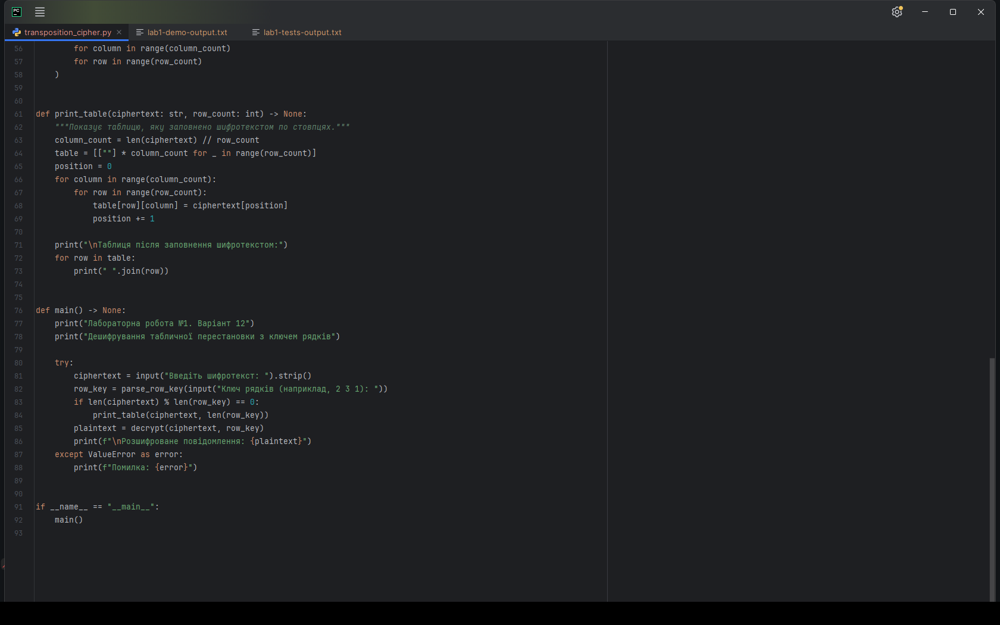
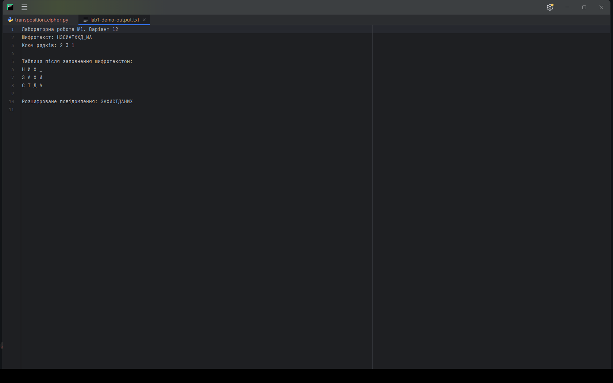
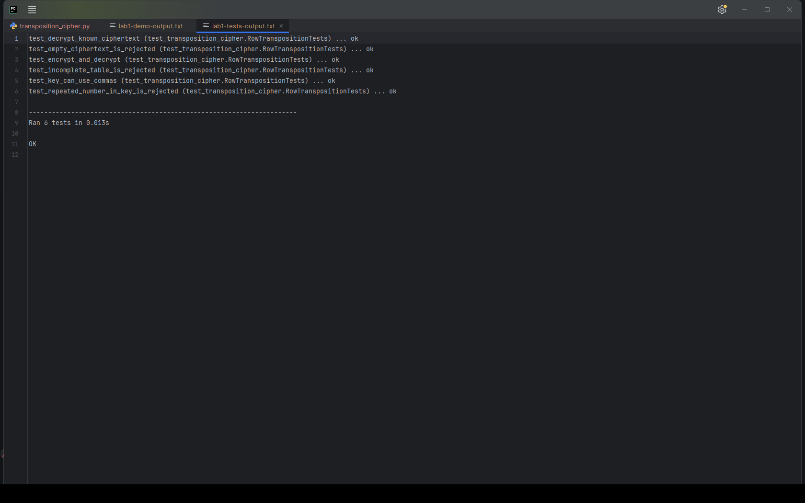

<div align="center">

**ЗВІТ**  
до лабораторної роботи №1  
з дисципліни **«Технології захисту інформації»**

**Тема:** «Шифрування методами перестановки»

</div>

| Відомості | Дані |
|---|---|
| Виконав | студент групи КН-24-1 Левченко Д. В. |
| Варіант | 12 |
| Перевірив | Андреєв П. І. |
| Рік виконання | 2026 |

## Мета роботи

Навчитися працювати з шифрами перестановки та реалізувати програму для відновлення повідомлення, зашифрованого табличним методом.

## Завдання

Для варіанта №12 потрібно виконати дешифрування методом рядково-стовпчикової табличної перестановки із застосуванням ключа рядків. Програма повинна дозволяти користувачу ввести шифротекст і ключ.

## Короткі теоретичні відомості

Під час перестановки символи повідомлення не замінюються іншими знаками, а тільки переходять на нові позиції. У цій роботі відкритий текст записується в прямокутну таблицю по рядках. Після цього рядки міняються місцями відповідно до ключа, а шифротекст зчитується по стовпцях.

Ключ `2 3 1` означає, що перший початковий рядок переходить на друге місце, другий — на третє, а третій — на перше. Під час дешифрування дії виконуються у зворотному порядку: таблиця заповнюється шифротекстом по стовпцях, потім рядки повертаються на початкові місця.

## Хід роботи

Для перевірки взято повідомлення `ЗАХИСТДАНИХ` і ключ рядків `2 3 1`. До повідомлення додано один службовий символ `_`, щоб заповнити таблицю повністю.

Початкова таблиця:

| | | | |
|:---:|:---:|:---:|:---:|
| З | А | Х | И |
| С | Т | Д | А |
| Н | И | Х | _ |

Після перестановки рядків:

| | | | |
|:---:|:---:|:---:|:---:|
| Н | И | Х | _ |
| З | А | Х | И |
| С | Т | Д | А |

Після зчитування по стовпцях отримано шифротекст `НЗСИАТХХД_ИА`. Його програма має перетворити назад на `ЗАХИСТДАНИХ`.

Алгоритм дешифрування:

1. Перевірити ключ: усі номери рядків мають бути присутні рівно один раз.
2. Обчислити кількість стовпців таблиці.
3. Заповнити переставлену таблицю шифротекстом зверху вниз по стовпцях.
4. За ключем повернути рядки на початкові місця.
5. Прочитати відновлену таблицю по рядках і прибрати службові символи в кінці.

Фрагмент, у якому повертаються початкові позиції рядків:

```python
original_table = [[""] * column_count for _ in range(row_count)]
for original_row, new_place in enumerate(row_key):
    original_table[original_row] = permuted_table[new_place - 1]

return "".join("".join(row) for row in original_table).rstrip(filler)
```

Повний код наведено у файлі [`transposition_cipher.py`](./transposition_cipher.py).

## Результати виконання

У PyCharm відкрито програму та перевірено реалізацію алгоритму.



<p align="center"><em>Рисунок 1 — Реалізація дешифрування табличної перестановки</em></p>

Після введення шифротексту `НЗСИАТХХД_ИА` та ключа `2 3 1` програма відобразила заповнену таблицю і відновила повідомлення `ЗАХИСТДАНИХ`.



<p align="center"><em>Рисунок 2 — Дешифрування контрольного повідомлення</em></p>

Також виконано автоматичні перевірки правильного результату, зворотності перетворення та реакції програми на неправильний ключ або розмір таблиці.



<p align="center"><em>Рисунок 3 — Успішне виконання шести тестів</em></p>

## Відповіді на контрольні питання

### 1. У чому полягає метод шифрування перестановкою?

Символи відкритого повідомлення залишаються тими самими, але розташовуються в іншій послідовності за правилом, яке задає ключ.

### 2. Що таке маршрутна перестановка?

Це спосіб, за якого текст записують у таблицю або іншу фігуру за одним маршрутом, а зчитують за іншим. Найпростіший приклад — запис по рядках і читання по стовпцях.

### 3. Який маршрут можна використовувати для реалізації шифру «Сцитала»?

Повідомлення записують по рядках таблиці з фіксованою кількістю стовпців, після чого читають по стовпцях. Така таблиця відтворює стрічку, намотану на жезл.

### 4. Як оцінити кількість ключів вертикальної та подвійної перестановки?

Для вертикальної перестановки з `m` стовпцями існує не більше `m!` ключів. Якщо окремо переставляються `m` стовпців і `n` рядків, кількість варіантів подвійної перестановки дорівнює `m! · n!`.

### 5. Приклад використання магічного квадрата для повідомлення «ВИПРОБОВУВАТИ_НА»

Повідомлення містить 16 символів, тому підходить квадрат 4×4:

| 16 | 2 | 3 | 13 |
|---:|---:|---:|---:|
| 5 | 11 | 10 | 8 |
| 9 | 7 | 6 | 12 |
| 4 | 14 | 15 | 1 |

У клітинку з номером 1 записується перший символ, з номером 2 — другий і так далі. Після читання таблиці по рядках отримуємо `АИПИОАВВУОБТР_НВ`. Для відновлення повідомлення символи знову вибираються у порядку номерів від 1 до 16.

### 6. Що таке шифрування перестановкою біт?

Це зміна позицій бітів усередині машинного подання символу або блока. Для розшифрування біти повертають на початкові місця зворотною перестановкою.

### 7. Як можна розкрити шифр перестановки?

Спочатку визначають можливий розмір блока або таблиці, потім перебирають варіанти перестановок і оцінюють отримані тексти за характерними словами та частими сполученнями літер. Роботу спрощують однакові ключі для багатьох повідомлень, передбачувані фрагменти тексту, повтори та невдале доповнення останнього блока. Основна складність полягає в тому, що осмисленими можуть бути декілька варіантів.

## Висновок

У роботі реалізовано дешифрування рядково-стовпчикової перестановки з ключем рядків. Програма перевіряє ключ, відновлює таблицю та повертає рядки на початкові місця. Для шифротексту `НЗСИАТХХД_ИА` отримано початкове повідомлення `ЗАХИСТДАНИХ`. Правильність алгоритму додатково перевірено автоматичними тестами.
