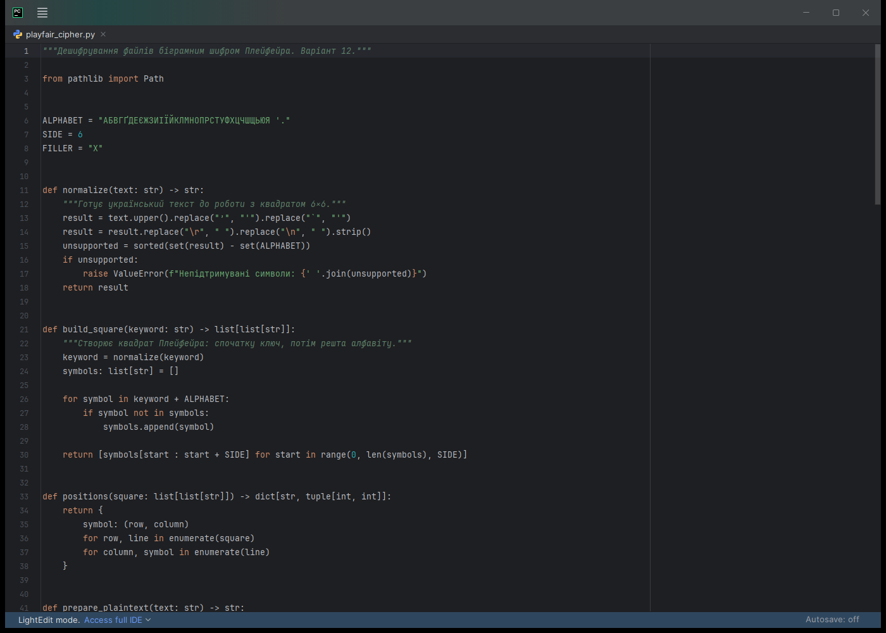
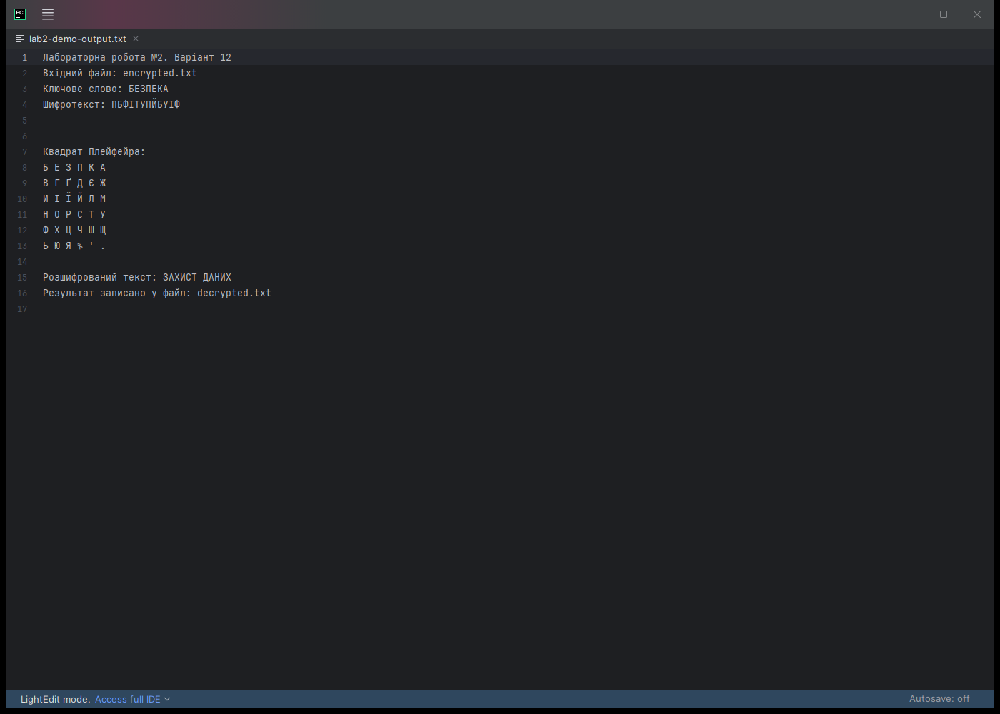
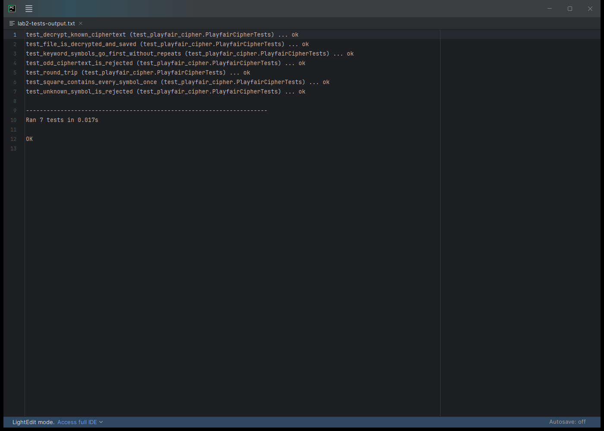

<div align="center">

**ЗВІТ**  
до лабораторної роботи №2  
з дисципліни **«Технології захисту інформації»**

**Тема:** «Шифрування методами заміни»

</div>

| Відомості | Дані |
|---|---|
| Виконав | студент групи КН-24-1 Левченко Д. В. |
| Варіант | 12 |
| Перевірив | Андреєв П. І. |
| Рік виконання | 2026 |

## Мета роботи

Ознайомитися з методами заміни та реалізувати дешифрування текстового файла біграмним шифром Плейфейра.

## Завдання

У варіанті №12 необхідно розшифровувати файли біграмним шифром Плейфейра. Програма повинна отримати шлях до файла із шифротекстом, ключове слово та шлях для збереження результату.

## Короткі теоретичні відомості

У шифрах заміни символи повідомлення замінюються іншими символами відповідно до ключа. Шифр Плейфейра працює не з окремими літерами, а з парами символів - біграмами.

Для українського тексту в програмі використано квадрат 6×6. Він містить 33 літери українського алфавіту, пробіл, апостроф і крапку. Спочатку до квадрата без повторів записується ключове слово, потім додаються інші символи алфавіту.

Для ключа `БЕЗПЕКА` отримано такий квадрат:

| Б | Е | З | П | К | А |
|:---:|:---:|:---:|:---:|:---:|:---:|
| В | Г | Ґ | Д | Є | Ж |
| И | І | Ї | Й | Л | М |
| Н | О | Р | С | Т | У |
| Ф | Х | Ц | Ч | Ш | Щ |
| Ь | Ю | Я | пробіл | ' | . |

Під час дешифрування застосовуються три правила:

1. Якщо символи біграми розташовані в одному рядку, беруться символи ліворуч від них.
2. Якщо символи розташовані в одному стовпці, беруться символи над ними.
3. Якщо символи утворюють прямокутник, кожен символ замінюється символом у тому самому рядку, але у стовпці другого символу.

## Хід роботи

Для контрольного прикладу створено файл [`encrypted.txt`](./encrypted.txt) із шифротекстом:

```text
ПБФІТУПЙБУІФ
```

Ключове слово - `БЕЗПЕКА`. Програма виконує такі дії:

1. Зчитує шифротекст із файла у кодуванні UTF-8.
2. Створює квадрат Плейфейра за ключовим словом.
3. Ділить шифротекст на біграми: `ПБ ФІ ТУ ПЙ БУ ІФ`.
4. Для кожної біграми застосовує правило рядка, стовпця або прямокутника.
5. Об'єднує отримані символи в повідомлення.
6. Записує результат у файл [`decrypted.txt`](./decrypted.txt).

Основний виклик дешифрування має вигляд:

```python
plaintext = "".join(
    transform_pair(ciphertext[index], ciphertext[index + 1], square, -1)
    for index in range(0, len(ciphertext), 2)
)
```

Повний код програми міститься у файлі [`playfair_cipher.py`](./playfair_cipher.py).

## Результати виконання

Реалізацію побудови квадрата та дешифрування відкрито у PyCharm.



<p align="center"><em>Рисунок 1 - Основна частина програми</em></p>

Для вхідного файла з шифротекстом `ПБФІТУПЙБУІФ` програма отримала повідомлення `ЗАХИСТ ДАНИХ` і зберегла його у файл `decrypted.txt`.



<p align="center"><em>Рисунок 2 - Дешифрування контрольного файла</em></p>

Додатково перевірено побудову квадрата, обробку ключа, відомий приклад, зворотність перетворення, роботу з файлами та реакцію на неправильні дані.



<p align="center"><em>Рисунок 3 - Успішне виконання семи тестів</em></p>

## Відповіді на контрольні питання

### 1. Які шифри називають шифрами заміни?

Це шифри, у яких кожен символ або група символів відкритого тексту замінюється іншим символом чи групою символів за певним правилом.

### 2. Що таке ключ шифру заміни?

Ключ - це правило або таблиця, яка визначає, на що потрібно замінювати символи відкритого тексту. У шифрі Плейфейра ключ задає порядок символів у квадраті.

### 3. Що називають множиною шифрозображень?

Це набір символів, якими може бути замінений певний символ відкритого тексту. У простій заміні кожна така множина зазвичай містить один символ.

### 4. Наведіть приклади шифрів простої заміни. Опишіть алгоритм одного з них.

Прикладами є шифр Цезаря, афінний шифр і шифр Цезаря з ключовим словом. У шифрі Цезаря кожна літера зміщується в алфавіті на однакову кількість позицій. Наприклад, при зміщенні на одну позицію `А` переходить у `Б`, а `Б` - у `В`.

### 5. Які основні недоліки шифрів простої заміни?

Вони зберігають частоту появи літер і характерні повтори мови. Тому за довгим шифротекстом можна визначити найчастіші символи, порівняти їх із частотами літер у мові та поступово відновити ключ.

## Висновок

У лабораторній роботі реалізовано дешифрування текстових файлів біграмним шифром Плейфейра. Для українського алфавіту побудовано квадрат 6×6, додано перевірку вхідних символів і збереження результату у файл. Шифротекст `ПБФІТУПЙБУІФ` із ключем `БЕЗПЕКА` було перетворено на повідомлення `ЗАХИСТ ДАНИХ`. Правильність програми підтверджено сімома автоматичними тестами.
